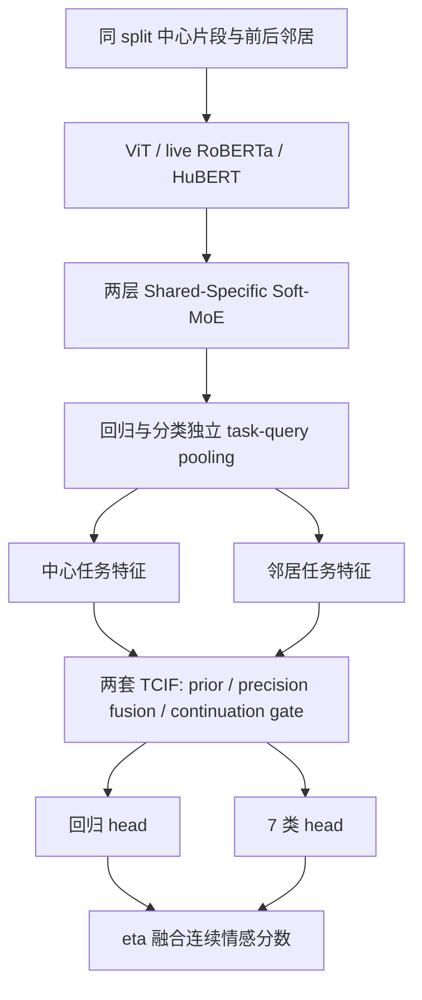

# 架构与源码导航

此文按打包源码和 `configs/tcif_paper_single_model.json` 整理。它描述 TCIF 主线；更早 StructV7.5.4 文档中的 temporal contrast 并非当前默认启用项。

## 阅读入口

| 文件 / 符号 | 职责 |
|---|---|
| `server-code/datasets/emotion_dataset.py` / `CMUMOSEIProcessDataset` | split、文本/脸帧/音频、embedding cache、邻域样本 |
| 同文件 / `build_temporal_context_index` | 同视频、同 split 的真实时间邻居及边界 mask |
| `server-code/models/models_emotion.py` / `EmotionM4OE.forward` | 中心与邻居编码、task feature、TCIF 接入与 heads |
| 同文件 / `SharedSpecificMoELayer`、`TaskQueryPool` | 受约束专家共享与任务查询 |
| `server-code/models/tcif.py` | TCIF、普通融合对照、四项消融 |
| `server-code/train_emotion.py` / `train` | 损失、冻结、优化器、训练与逐轮选模 |
| 同文件 / `_compute_tcif_context_aux_loss`、`_compute_tcif_transition_gate_loss` | TCIF 两项辅助监督 |
| 同文件 / `_build_optimizer_param_groups`、`_update_best_checkpoints` | 参数分组与双 checkpoint 选择 |
| `server-code/head_utils.py` / `compute_final_prediction` | cls7 expected value 与 eta 融合 |
| `server-code/eval_all_mosei_maefixed.py` | 根据同名 JSON sidecar 重建模型、导出逐样本预测 |
| `scripts/tcif_paper_ablation.py` / `score_details`、`summarize` | 按统一口径重算指标和完整 sweep 汇总 |

## 主线张量与 active 配置

ViT 接受 4 个采样中心，每个包含前/中/后三帧的上下文组；attention frame fusion 后约 788 个视觉 token。文本最大 128 token，音频 16 kHz、最多 6 秒，经 HuBERT 编码。三路统一到 768 维。

视觉与音频使用冻结 backbone cache，RoBERTa 最后两层解冻，`use_text_cache=false`。中心与邻居的文本都需要实时前向。缓存是 backbone hidden states，不是最终 task feature。

两层 Shared-Specific Soft-MoE 每层包含模态独立 self-attention、共享 router/expert pool。主线 text/audio/vision-specific 各 4 个专家，shared 4 个，temporal experts 0；文本不访问 shared experts。实现是 dense soft routing，不是 top-k 稀疏专家。务必直接核对代码中的 softmax 轴与掩码，不用旧文档代替实现。

三模态 token 拼接后由两个独立 query pooling。每个任务特征拼接 query 结果与三种模态 masked mean，维度 4×768=3072。回归和分类分别做 TCIF；shared_filter 消融才共享滤波器。

## TCIF

`forward` 分别编码中心 batch 和展平的邻居 batch，然后按 `[B,C,3072]` 还原邻居任务特征；默认 C=2。邻域构造在 dataset 当前 split 的 ID 集合中完成，不跨 train/val/test 取邻居。

TCIF 对中心和邻居预测 latent mean/variance，宽度128。邻居评分使用相对位置、距离衰减、邻居统计，形成不依赖中心特征的 prior；中心与 prior 按精度融合。一个隐藏宽度64的 continuation gate 读取 innovation 与方差等特征，控制残差修正强度。

输出投影零初始化，使初始预测保持局部模型函数；无有效邻居时保持局部特征。模型中的“context”输出模式仍是局部特征加 context delta；真正用于 context 辅助预测的是 prior latent 的独立头，阅读时不要混淆。

## 损失与读出

默认主损失：`smooth_l1(y_reg,y)` + `.5 × hard_CE(cls7,y_bin)`。

上下文辅助：`.1 × (context_reg_loss + .5 × context_CE)`，只作用于有邻居样本。Gate 辅助权重 `.05`：目标随中心与邻居平均标签距离指数下降；检测到非零相反符号邻居时目标置为0。标签用于训练监督，不作为推理 gate 输入。

当前配置禁用 sign head、temporal contrast loss、OACR 和其他符号正则。相关实现仍保留，便于评估已有备选方案；不能把所有 CLI 参数都算进默认目标。

最终 `y = (1-eta) y_reg + eta × E[class_center]`，中心为 -3…3。训练选 checkpoint 的 eta=.4，消融主表 eta=.8；完整后评估分别扫描两个 checkpoint 的七个 eta。
